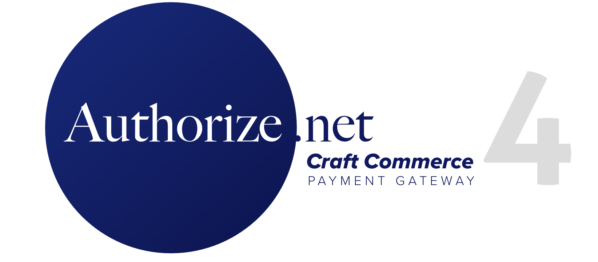

# Authorize.net for Craft Commerce </h1>

This gateway utilizes the thephpleague/omnipay-authorizenet Authorize.net driver, and will update the Authorize.net AIM gateway from Craft Commerce 1.

#### Requirements
- Craft 3.1.5 (or later)
- Craft Commerce 2

This gateway is a commercial plugin for Craft 3 and can be installed using the Craft plugin store, or by updating the composer.json file to require this gateway.

```composer require digital-pros/commerce-authorize ```

## Using the Gateway

After installing the gateway, the default form fields will submit a transaction to Authorize.net. 

### Default Payment Form

When enabled in the Gateway settings, the default payment form will be used. When additional customization is needed, the custom forms below should be used. When this toggle is enabled, the following line of code will render the payment form.

    {{ cart.gateway.getPaymentFormHtml({}) }}

### Custom Payment Form
***The examples below have been simplified for illustration purposes.***
	
	<label>Card Holder</label>
	<input name="firstName" placeholder="First Name" required="required" type="text">
	<input name="lastName" placeholder="Last Name" required="required" type="text">

	<label>Card Number</label>
	<input id="number" name="number" placeholder="Card Number" required="required" type="text">

	<label>Card Expiration Date</label>
	<select id="month" name="month"><option value="12">12</option>...</select>
	<select id="year" name="year"><option value="2019">2019</option>...</select>

	<label>CVV/CVV2</label>
	<input id="cvv" name="cvv" placeholder="CVV" required="required" type="text">
	
	{{ cart.gateway.getPaymentFormHtml({})|raw }}

	<button id="submit" name="submit">Pay Now</button>

## Accept.js

If Accept.js is enabled in the plugin settings, the gateway will require two hidden fields (`token` and `tokenDescriptor`), which are sent back to Authorize.net after the card is validated. Accept.js also requires an adjustment to the submit button so that the payment form only submits after the card has been validated by Accept.js. As long as the two hidden fields are defined and filled by Accept.js, the credit card details will not be required.

### Custom Accept.js Payment Form

When using the custom Accept.js form illustrated below, the payment form must have an id of `paymentForm` so that payment details can be sent to Authorize.net to create the token. (i.e. ```<form id='paymentForm'></form>```)

If `sendPaymentDataToAnet()` contains a `true` parameter, `sendPaymentDataToAnet(true)` the card data will be removed from the credit card fields after the token has been created, but before the form is submitted to the server for processing. For the default form above, this option is specified in the gateway settings.

    <label>Card Holder</label>
	<input name="firstName" placeholder="First Name" required="required" type="text">
	<input name="lastName" placeholder="Last Name" required="required" type="text">

	<label>Card Number</label>
	<input id="number" name="number" placeholder="Card Number" required="required" type="text">

	<label>Card Expiration Date</label>
	<select id="month" name="month"><option value="12">12</option>...</select>
	<select id="year" name="year"><option value="2019">2019</option>...</select>

	<label>CVV/CVV2</label>
	<input id="cvv" name="cvv" placeholder="CVV" required="required" type="text">
	
	<!-- Required fields and changes for Authorize.net Accept.js -->
	
	<input id="token" name="token" type="hidden">
	<input id="tokenDescriptor" name="tokenDescriptor" type="hidden"> 
	
	{{ cart.gateway.getPaymentFormHtml({})|raw }}

	<button id="authorizeSubmit" name="authorizeSubmit" onclick="event.preventDefault(); sendPaymentDataToAnet(true);">Pay Now</button>
	
## Returns and Refunds

This gateway supports partial refunds and full refunds after the transaction has successfully settled in Authorize.net. In the plugin settings, there's an option to void the transaction if a refund fails, but the transaction will be voided entirely if the refund fails.

## Saved Payment Sources

Payment sources are saved using the Authorize.net Customer Information Manager (CIM). **CIM must be enabled inside Authorize.net prior to enabling this feature.** After enabling stored payment sources in the gateway settings, the only credit card information stored in the database will be the last four digits of the card number so that the card can be identified later (if Accept.js is not enabled). 

Credit Cards will be added to/removed from a customer profile inside the Authorize.net Customer Information Manager. If Accept.js is enabled, a separate profile will be created for each stored payment source. *The customer profile will not be deleted from Authorize.net when the cards have been removed.*

&#9888; **WARNING: If this feature is disabled after payment sources are saved, an error will be thrown if the customer tries to use or modify the payment source.** *You may wish to run a database backup and then manually clear the Payment Sources database table before disabling this feature.*

## Subscriptions

This gateway does not currently support subscriptions.

## Support

Questions? Feel free to open an issue, or send us a note at hello@digitalpros.co.
