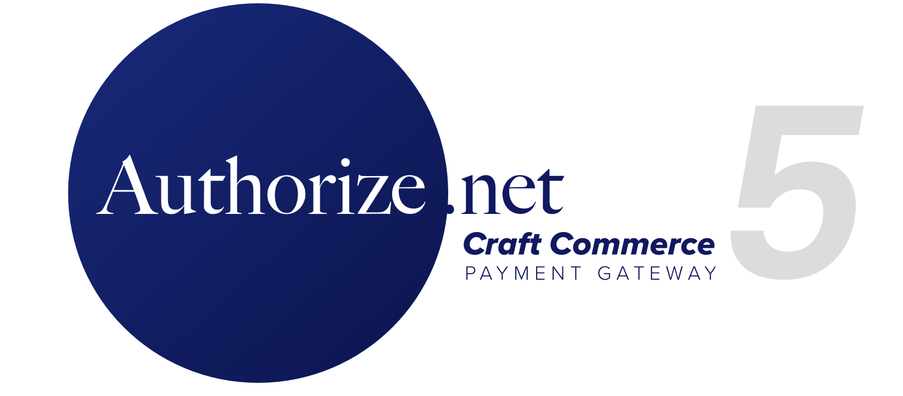

# Authorize.net for Craft Commerce </h1>

This gateway utilizes the thephpleague/omnipay-authorizenet Authorize.net driver, and will update the Authorize.net AIM gateway from Craft Commerce 1.

#### Requirements
- Craft 4 (or later)
- Craft Commerce 4

> **Note**
> Craft Commerce 4 changed the name and ID attributes on payment fields to include the payment handle (see the code examples below). Sites that use the default form will be updated automatically, but payment forms that use a custom form will need to be updated. Please run test transactions through each Authorize.net gateway after updating to this version. Run into a problem? Open an issue or drop us a note at hello@digitalpros.co.

This gateway is a commercial plugin for Craft 4 and can be installed using the Craft plugin store, or by updating the composer.json file to require this gateway.

```composer require digital-pros/commerce-authorize ```

## Using the Version 4 Beta Version

You can upgrade to this development version by updating your composer.json file to pull from this branch.

``` "digital-pros/commerce-authorize": "dev-develop-v4", ```

## Using the Gateway

After installing the gateway, the default form fields will submit a transaction to Authorize.net. 

### Default Payment Form

When enabled in the Gateway settings, the default payment form will be used. When additional customization is needed, the custom forms below should be used. When this toggle is enabled, the following line of code will render the payment form.

    {{ cart.gateway.getPaymentFormHtml({}) }}

### Custom Payment Form
***The examples below have been simplified for illustration purposes.***
	
	<label>Card Holder</label>
	<input name="paymentForm[gatewayHandleGoesHere][firstName]" placeholder="First Name" required="required" type="text">
	<input name="paymentForm[gatewayHandleGoesHere][lastName]" placeholder="Last Name" required="required" type="text">

	<label>Card Number</label>
	<input id="paymentForm-gatewayHandleGoesHere-number" name="paymentForm[gatewayHandleGoesHere][number]" placeholder="Card Number" required="required" type="text">

	<label>Card Expiration Date</label>
	<select id="paymentForm-gatewayHandleGoesHere-month" name="paymentForm[gatewayHandleGoesHere][month]"><option value="12">12</option>...</select>
	<select id="paymentForm-gatewayHandleGoesHere-year" name="paymentForm[gatewayHandleGoesHere][year]"><option value="2019">2019</option>...</select>

	<label>CVV/CVV2</label>
	<input id="paymentForm-gatewayHandleGoesHere-cvv" name="paymentForm[gatewayHandleGoesHere][cvv]" placeholder="CVV" required="required" type="text">
	
	{{ cart.gateway.getPaymentFormHtml({})|raw }}

	<button id="paymentForm-gatewayHandleGoesHere-submit" name="paymentForm[gatewayHandleGoesHere][submit]">Pay Now</button>

## Accept.js

If Accept.js is enabled in the plugin settings, the gateway will require two hidden fields (`token` and `tokenDescriptor`), which are sent back to Authorize.net after the card is validated. Accept.js also requires an adjustment to the submit button so that the payment form only submits after the card has been validated by Accept.js. As long as the two hidden fields are defined and filled by Accept.js, the credit card details will not be required.

### Custom Accept.js Payment Form

When using the custom Accept.js form illustrated below, the payment form must have an id of `paymentForm` so that payment details can be sent to Authorize.net to create the token. (i.e. ```<form id='paymentForm'></form>```)

If `sendPaymentDataToAnet()` contains a `true` parameter, `sendPaymentDataToAnet(true)` the card data will be removed from the credit card fields after the token has been created, but before the form is submitted to the server for processing. For the default form above, this option is specified in the gateway settings.

    <label>Card Holder</label>
	<input name="paymentForm[gatewayHandleGoesHere][firstName]" placeholder="First Name" required="required" type="text">
	<input name="paymentForm[gatewayHandleGoesHere][lastName]" placeholder="Last Name" required="required" type="text">

	<label>Card Number</label>
	<input id="paymentForm-gatewayHandleGoesHere-number" name="paymentForm[gatewayHandleGoesHere][number]" placeholder="Card Number" required="required" type="text">

	<label>Card Expiration Date</label>
	<select id="paymentForm-gatewayHandleGoesHere-month" name="paymentForm[testingGateway][month]"><option value="12">12</option>...</select>
	<select id="paymentForm-gatewayHandleGoesHere-year" name="paymentForm[gatewayHandleGoesHere][year]"><option value="2019">2019</option>...</select>

	<label>CVV/CVV2</label>
	<input id="paymentForm-gatewayHandleGoesHere-cvv" name="paymentForm[gatewayHandleGoesHere][cvv]" placeholder="CVV" required="required" type="text">
	
	<!-- Required fields and changes for Authorize.net Accept.js -->
	
	<input id="paymentForm-gatewayHandleGoesHere-token" name="paymentForm[gatewayHandleGoesHere][token]" type="hidden">
	<input id="paymentForm-gatewayHandleGoesHere-tokenDescriptor" name="paymentForm[gatewayHandleGoesHere][tokenDescriptor]" type="hidden"> 
	
	{{ cart.gateway.getPaymentFormHtml({})|raw }}

	<button id="authorizeSubmit" name="authorizeSubmit" onclick="event.preventDefault(); sendPaymentDataToAnet(true);">Pay Now</button>
	
## Returns and Refunds

This gateway supports partial refunds and full refunds after the transaction has successfully settled in Authorize.net. In the plugin settings, there's an option to void the transaction if a refund fails, but the transaction will be voided entirely if the refund fails.

## Saved Payment Sources

Payment sources are saved using the Authorize.net Customer Information Manager (CIM). **CIM must be enabled inside Authorize.net prior to enabling this feature.** After enabling stored payment sources in the gateway settings, the only credit card information stored in the database will be the last four digits of the card number so that the card can be identified later (if Accept.js is not enabled). 

Credit Cards will be added to/removed from a customer profile inside the Authorize.net Customer Information Manager. If Accept.js is enabled, a separate profile will be created for each stored payment source. *The customer profile will not be deleted from Authorize.net when the cards have been removed.*

When Accept.js is enabled, Craft Commerce does not process the credit card number as only a token is passed back for processing. This security measure restricts the payment sources from displaying the last four digits of the card number on the payment source. In order to save a payment source with a custom name, a description field can be added to the payment form. This could potentially be a hidden field where ***only*** the last four digits of the card could be entered before the form is submitted.

	<input id="paymentForm-gatewayHandleGoesHere-description" name="paymentForm[gatewayHandleGoesHere][description]" placeholder="Card Name" />

&#9888; **WARNING: If this feature is disabled after payment sources are saved, an error will be thrown if the customer tries to use or modify the payment source.** *You may wish to run a database backup and then manually clear the Payment Sources database table before disabling this feature.*

## Subscriptions

As of version 1.5, we've added a new subscriptions gateway to this Authorize.net plugin. Because Authorize.net doesn't offer subscription plans, this feature has been implemented using the Authorize.net CIM and Recurring Billing. This implementation does require a separate gateway, but both gateways can run simultaneously in the same Commerce installation. The subscription gateway cannot be used for regular transactions or refunds, it only works within Craft Commerce subscriptions. *You will want to exclude this gateway's saved payment methods from your checkout process.*

With those things in mind, you will setup all of your "plans" in the gateway settings before referencing those plans within the Craft Commerce subscriptions plans settings area. Plans can be set to bill on a daily or monthly basis, with a minimum of 7 days or 1 month between each billing cycle. You can offer trial periods with adjustable (or free) rates, and even offset the first billing date (which will extend a trial).

When specifying the trial length from the front-end, be sure to specify the length in periods (matching your plan settings in the gateway) rather than days. The plugin will convert the months to days automatically, adding the additional days from the extended start date as necessary.

Because Authorize.net CIM requires additional billing fields, there will be some additional required fields depending on your Authorize.net settings. All of these fields are available within the default form, but could be moved to hidden fields if you wished to pull this information from the customer profile.

You will need to setup webhooks in your Authorize.net account in order for Authorize.net to properly calculate the next billing date and cancel a subscription when it's no longer valid. A valid Signature Key is also required in the gateway settings to validate that the calls originate from Authorize.net. You will want to subscribe to all Subscription Events, and all Payment Events except for the fraud (x3) and priorAuthCapture.created events.

*Note: Authorize.net requires a 15-second delay while creating a CIM contact, so you may want to build a waiting indicator into your interface.*

We've enabled the discussions area in the repository for general subscriptions feedback, but if you have questions about the new subscription functionality, or if you find a bug while testing, please let us know by opening an issue or dropping us a note at hello@digitalpros.co.

## Support

Questions? Feel free to open an issue, or send us a note at hello@digitalpros.co.
